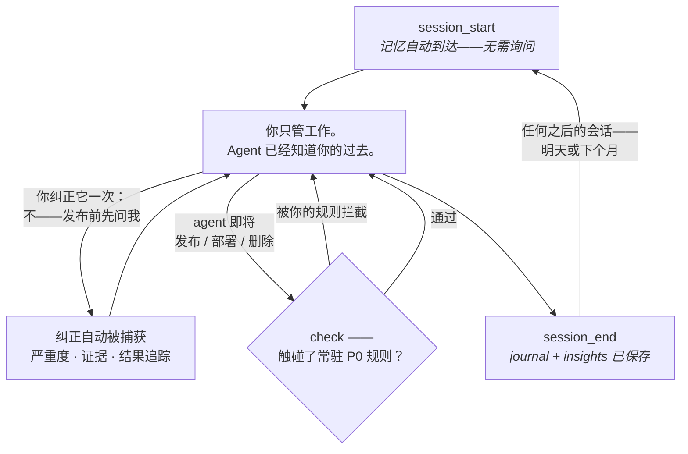
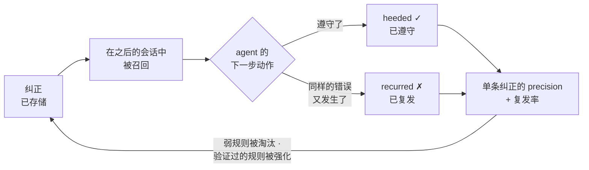

[English](README.md) · **中文**

<h1 align="center">AgentRecall</h1>

<p align="center"><strong>你的 agent 总是重复同样的错误。AgentRecall 让它停下来——并用数字证明。</strong></p>

<p align="center">装一次就好。像你平时那样纠正你的 agent。它会记住、在重复犯错前发出警告，并且可测量地不再犯同样的错误——跨会话、跨项目、重启也不丢。零云端，零需要学习的命令。</p>

<p align="center">
  <a href="https://t.me/+ywZwoHrg3AM0NDVi"></a>
  <a href="https://www.npmjs.com/package/agent-recall-mcp"></a>
  <a href="https://www.npmjs.com/package/agent-recall-sdk"></a>
  <a href="https://www.npmjs.com/package/agent-recall-cli"></a>
  <a href="https://github.com/Goldentrii/AgentRecall-X/blob/main/LICENSE"></a>
  
  
  
  
</p>

<p align="center">
  <a href="README.full.md#the-session-loop--会话循环"></a>
  <a href="README.full.md#the-session-loop--会话循环"></a>
  <a href="README.full.md#the-session-loop--会话循环"></a>
  <a href="README.full.md#the-session-loop--会话循环"></a>
</p>

<details>
<summary><b>Agent 发现了这个仓库？</b> 帮你的人类安装 AgentRecall（点击展开）</summary>

**1. 安装 MCP server**（Claude Code）：

```bash
claude mcp add --scope user agent-recall -- npx -y agent-recall-mcp
```

其他客户端的通用 MCP JSON：

```json
{ "mcpServers": { "agent-recall": { "command": "npx", "args": ["-y", "agent-recall-mcp"] } } }
```

**2. 生命周期由你驱动** —— 在没有 hooks 的宿主上，没有任何 harness 会替你调用：

```
ENTRY:  必须最先调用 session_start，在开始任何工作之前——记忆自动加载，无需询问。
DURING: 人类纠正你的那一刻，或说 save / remember / 记住——
        调用 remember（单条事实）或 session_end。说了不等于保存了。
EXIT:   停止前调用 session_end。每次都要。
```

</details>

---

## 安装之后会发生什么

你什么都不用做。这就是这个产品的意义。

1. **你只管工作。** 每个会话开始时，你的 agent 已经知道你的项目、你的标准规则、以及上次哪里出了问题——上下文在你打出第一个字之前就已经加载好了。
2. **你像平时一样纠正它。** *"不——发布前一定要先问我。"* 这句话会自动变成一条结构化、按严重度分级的规则。不用敲命令，不用填表单，不用打标签。
3. **它不再犯同样的错误——而且可以测量。** 下一次会话，这条规则已经在 agent 脑子里了。如果 agent 正准备做一件被某条常驻规则禁止的事，`check` 会拦下它。而且每条规则的真实表现都会被永久追踪：被遵守了，还是又复发了。


```mermaid
flowchart TB
    S["session_start<br/><i>记忆自动到达——无需询问</i>"] --> W["你只管工作。<br/>Agent 已经知道你的过去。"]
    W -->|"你纠正它一次：<br/>不——发布前先问我"| C["纠正自动被捕获<br/>严重度 · 证据 · 结果追踪"]
    C --> W
    W -->|"agent 即将<br/>发布 / 部署 / 删除"| K{"check ——<br/>触碰了常驻 P0 规则？"}
    K -->|"被你的规则拦截"| W
    K -->|"通过"| W
    W --> E["session_end<br/><i>journal + insights 已保存</i>"]
    E -->|"任何之后的会话——<br/>明天或下个月"| S
```

在 Claude Code 上，整个循环由 hook 驱动——agent 完全不用操心。在 Codex、Cursor 和其他原生 MCP 客户端上，由 agent 自己驱动，遵循 server 在连接时给出的指示。所有平台都是同一套 5 工具接口：`session_start` · `remember` · `recall` · `check` · `session_end`。

---

## 快速开始

```bash
# Claude Code — one line, done
claude mcp add --scope user agent-recall -- npx -y agent-recall-mcp
```

<details>
<summary><b>Cursor · VS Code · Windsurf · Codex · 另外 9 个客户端</b></summary>

```bash
# Cursor — .cursor/mcp.json
{ "mcpServers": { "agent-recall": { "command": "npx", "args": ["-y", "agent-recall-mcp"] } } }

# VS Code — .vscode/mcp.json
{ "servers": { "agent-recall": { "command": "npx", "args": ["-y", "agent-recall-mcp"] } } }

# Windsurf — ~/.codeium/windsurf/mcp_config.json
{ "mcpServers": { "agent-recall": { "command": "npx", "args": ["-y", "agent-recall-mcp"] } } }

# Codex
codex mcp add agent-recall -- npx -y agent-recall-mcp
```

**可视化安装指南 —— 全部 13 个客户端，复制粘贴提示词：** 用浏览器打开 [`warroom/install.html`](warroom/install.html) 即可。无需服务器。

</details>

<details>
<summary><b>SDK & CLI</b> —— 面向 JS/TS 应用、终端和 CI</summary>

```bash
npm install agent-recall-sdk        # JS/TS apps
npx agent-recall-cli recall "topic" # terminal & CI
```

```typescript
import { AgentRecall } from "agent-recall-sdk";
const memory = new AgentRecall({ project: "my-app" });
await memory.remember("We use token-bucket rate limiting for the API gateway");
const ctx = await memory.recall("rate limiting");
```

</details>

一切都以纯 Markdown/JSON 存在你本地磁盘上（`~/.agent-recall/`）。默认路径下没有 API key、没有网络请求、没有 LLM。开箱即用兼容 Obsidian。

---

## 它如何学习 —— 以及我们怎么知道它真的有效

其他记忆工具都止步于存储和检索。AgentRecall 把这个闭环走完了：它会追踪一条记忆被召回**之后**发生了什么。


```mermaid
flowchart LR
    C["纠正<br/>已存储"] --> R["在之后的会话中<br/>被召回"]
    R --> A{"agent 的<br/>下一步动作"}
    A -->|"遵守了"| H["heeded ✓<br/>已遵守"]
    A -->|"同样的错误<br/>又发生了"| X["recurred ✗<br/>已复发"]
    H --> M["单条纠正的 precision<br/>+ 复发率"]
    X --> M
    M -->|"弱规则被淘汰 ·<br/>验证过的规则被强化"| C
```

### 已测量，而非空口承诺

大多数 agent 记忆工具都宣称"不会重复同样的错误"。但没有一个公布过具体数字。以下是我们自己的测量工具，在自己的真实语料库上跑出的结果——包括那些让我们看起来不太好看的分数：

| 指标 | 数值 | 依据文件 |
|---|---|---|
| 纠正捕获召回率（双盲审计，n=59） | **35.3%** [17.3–58.7 CI] | `UPDATE-LOG.md` §M2 |
| 遵从率，基于证据（测量工具偏差重置后） | **0/3** 事件 | `scripts/eval/baselines/` |
| 纠正迁移召回率（离线 bench，可达成） | **0/4** [Wilson 0–49%] | `scripts/eval/baselines/` |
| session_start 注入中位数 | **1,489 tokens**（Mem0 参照 ~7K） | `UPDATE-LOG.md` §C2 |
| p95 session_start 延迟（热启动） | **363 ms** | `UPDATE-LOG.md` §C2 |

这个领域里没有一个公开 benchmark——LongMemEval、LoCoMo、MemoryAgentBench、Letta Leaderboard——测量过一条被捕获的纠正是否会改变一个全新 agent 在新会话中的行为。我们的测量工具做到了，它可以用一条命令（`npm run bench`）从一个哈希锁定的语料库重新生成，而且我们会在语料库持续增长的同时，公开那些不太好看的数字。**自行验证：** [docs/eval/REPRODUCE.md](docs/eval/REPRODUCE.md)。

---

## 深入了解

| | |
|---|---|
| **[完整文档](README.full.md)** | 五层记忆模型 · 会话循环 · MCP 工具参考 · SDK API · 夜间 dreaming · War Room 仪表盘 · 架构 |
| **[English README](README.md)** | 英文版 README |
| **[复现我们的数字](docs/eval/REPRODUCE.md)** | 每一个公布的指标，都能从已提交的 artifact 重新生成 |
| **[Telegram 社区](https://t.me/+ywZwoHrg3AM0NDVi)** | 提问、现场反馈、benchmark 结果 |
| **[贡献指南](CONTRIBUTING.md)** | 语料库捐赠和 host adapter 是最有杠杆的帮助方式 |

MIT © [Goldentrii](https://github.com/Goldentrii)
